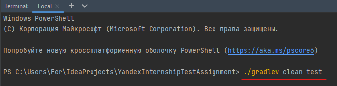

### Процедура запуска автотестов

## Для запуска авто тестов нужны следующие программы и версии языков.
1. Intellij idea
1. JDK 11

## Для написания авто тестов использовались следующие инструменты.
1. ЯП Java
1. Фреймворк JUnit
1. Библиотека REST Assured
1. Библиотека Lombok
1. Библиотека Gson

## Для запуска авто тестов нужны следующие действия.
1. Запустить Intellij idea
1. Запустить тесты из терминала: ```./gradlew clean test```

